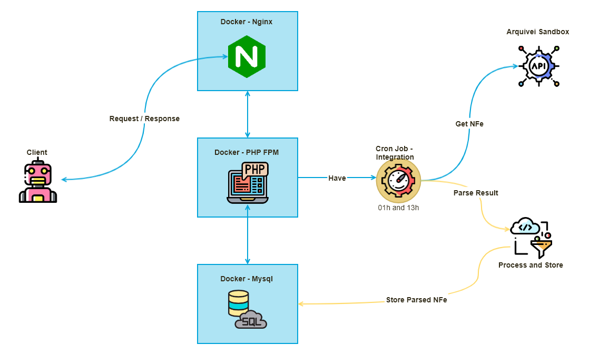

# Arquivei - Bolton Challenge

## Table of contents
- [Getting started](#getting-started)
    * [References](#references)
    * [Clone Repository](#clone-repository)
    * [Up Project](#up-project)
- [Generation Swagger documentation](#generation-swagger-documentation)
- [Documentation](#documentation)
    * [Architecture](#architecture)
    * [Allowed verbs and Port](#allowed-verbs-and-port)
    * [Required in the header of all requests](#required-in-the-header-of-all-requests)
    * [Resources](#resources)
        * [With authentication](#with-authentication)
            * [nfe](#nfe)
            * [download](#download)
    * [Swagger documentation](#swagger-documentation)
    * [Run automatized tests](#run-automatized-tests)

## Getting startd

### References
This application was made on the criteria of the [Bolton Challenge](https://public.3.basecamp.com/p/9wuA4g7RB79CBJkjvCzdKNFS)

Application endpoints are documented in [Swagger Documentation](http://127.0.0.1:8000/swagger/index.html)

This application uses the packages

- [medeirosdev/arquivei-nfe](https://github.com/MedeirosDev/arquivei-nfe)
- [zircote/swagger-php](https://github.com/MedeirosDev/arquivei-nfe)

### Clone Repository
```
git clone https://github.com/MedeirosDev/arquivei.git
```

### Up Project
Up Containers
```
docker-compose up -d --build
```

Update project dependencies
```
docker exec -it arquivei-app composer update
```

copy .env.example to .env
```
docker exec -it arquivei-app cp .env.example .env
```

Generate Laravel key
```
docker exec -it arquivei-app php artisan key:generate
```


Clear cache
```
docker exec -it arquivei-app php artisan cache:clear
docker exec -it arquivei-app composer dumpautoload
```

Run Migrations with seeders
```
docker exec -it arquivei-app php artisan migrate:refresh --seed
```

Run Process Nfe
```
docker exec -it arquivei-app php artisan process:nfe
```


## Generation Swagger documentation
```bash
docker exec -it arquivei-app ./extra_files_for_documentations/swagger/swagger.sh
``` 


## Documentation

### Architecture



### Allowed verbs and Port
 `GET`
 
 Port: `8000`

### Required in the header of all requests
Media type
```
Content-Type: application/json
Accept: application/json
```

Authorization
```
x-api-id: f96ae22f7c5d74fa4d78e764563d52811570588e
x-api-key: cc79ee9464257c9e1901703e04ac9f86b0f387c2
```

# Resources
## With authentication
### NFe
[GET /nfe/{access_key}](http://127.0.0.1:8000/nfe/{access_key}) - Returns NFe

Request headers
```
Content-Type: application/json
Accept: application/json
x-api-id: f96ae22f7c5d74fa4d78e764563d52811570588e
x-api-key: cc79ee9464257c9e1901703e04ac9f86b0f387c2
```

Request body
```json
{}
```

Response body
```json
{
    "id": 1,
    "access_key": "{access_key}",
    "amount": 365.89,
    "xml": "http://127.0.0.1:8000/api/nfe/{access_key}",
    "created_at": "2019-11-12 23:11:59",
    "updated_at": "2019-11-12 23:11:59"
}
```

### Download
[GET /download/{access_key}](http://127.0.0.1:8000/download/{access_key}) - Download xml of NFe

Request headers
```
Content-Type: application/json
Accept: application/json
x-api-id: f96ae22f7c5d74fa4d78e764563d52811570588e
x-api-key: cc79ee9464257c9e1901703e04ac9f86b0f387c2
```

Request body
```json
{}
```

Response Stream file xml named `{access_key}.xml`


### Swagger documentation
[Access documentation](http://127.0.0.1:8000/swagger/index.html) 

For refresh Swagger documentation `swagger.js`
```bash
docker exec -it arquivei-app ./extra_files_for_documentations/swagger/swagger.sh
``` 


### Run automatized tests

Create database for testing
```bash
docker exec -it arquivei-app php artisan testdb:create
``` 

Run migrate for testing database
```bash
docker exec -it arquivei-app php artisan migrate --env=testing --seed
``` 


Run automatized tests
```bash
docker exec -it arquivei-app ./vendor/bin/phpunit
``` 
